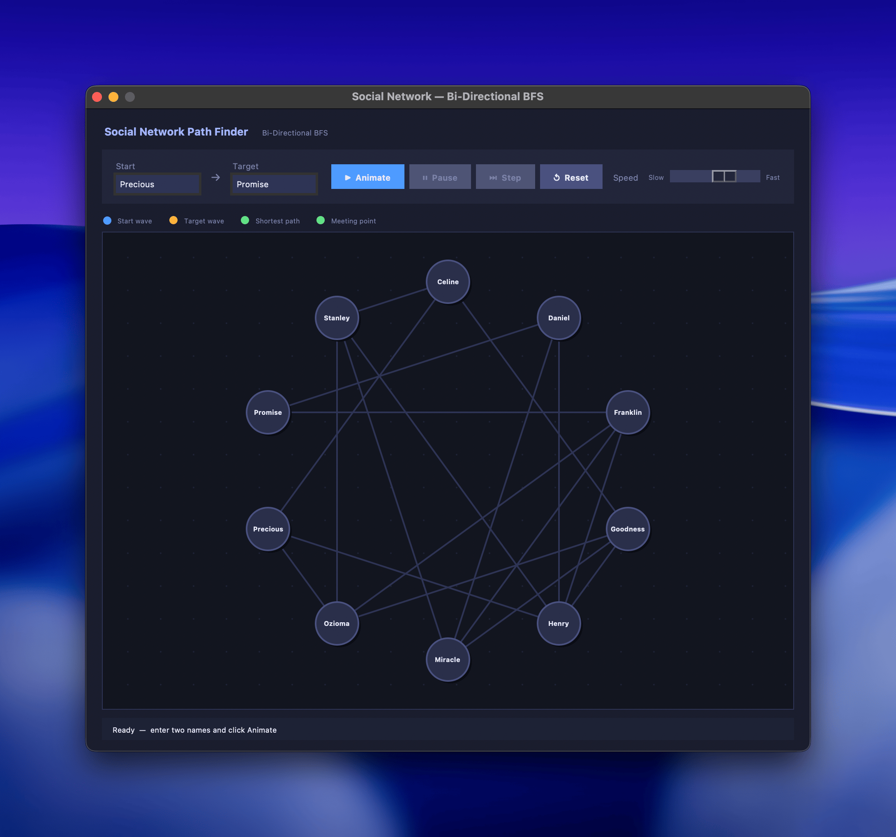
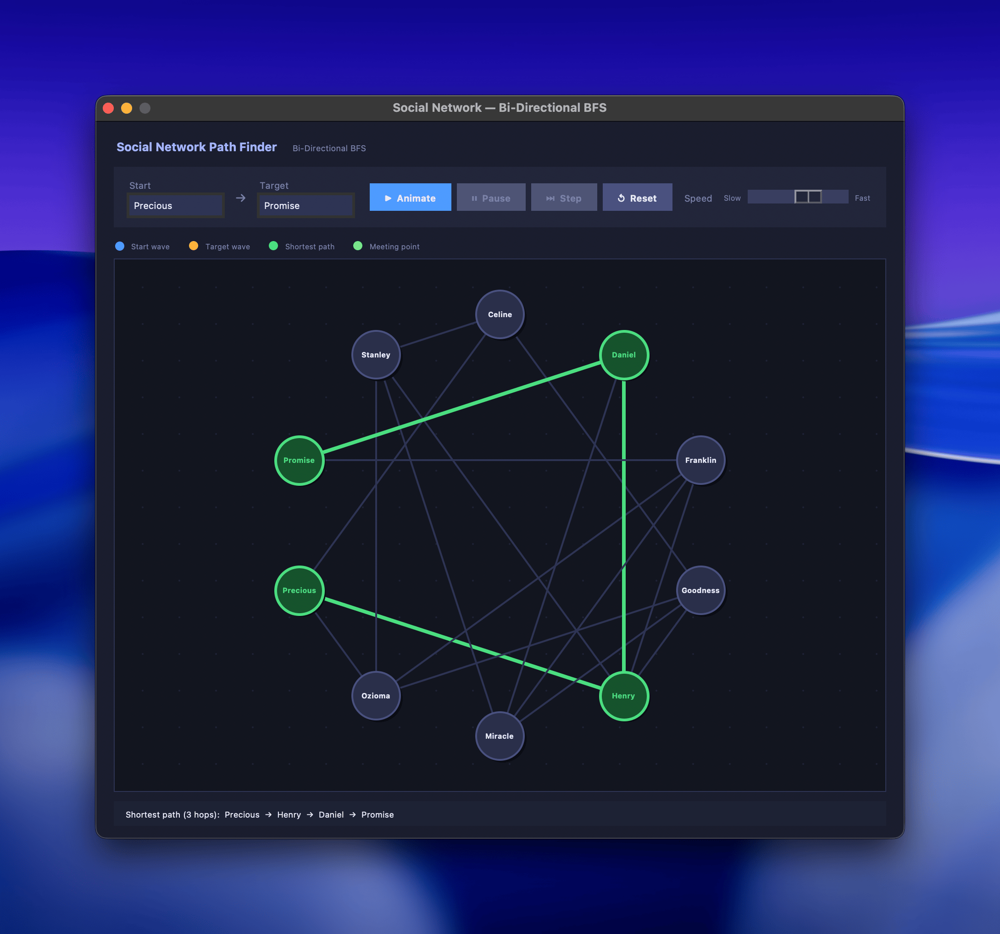

# Social Network Path Finder

A Python desktop app that finds and animates the **shortest connection path** between two people in a social network using **Bi-Directional Breadth-First Search (Bi-BFS)**.

Built as a visual explainer for graph theory concepts — each person is a node, each friendship is an undirected edge.

---

## Demo

### Initial state


### Shortest path found


### Full animation

[https://github.com/EsinShadrach/social-media-network-path/raw/main/full-flow.mp4](https://github.com/user-attachments/assets/e8d45e8a-e652-48e0-a517-52f617563709)

---

## How it works

Standard BFS explores outward from one node. **Bi-BFS runs two searches at once** — one from the start person, one from the target — and stops the moment they meet in the middle.

This halves the search space on large graphs and makes the animation more interesting to watch: you see a blue wave and an orange wave expanding toward each other until they collide.

```
Precious → Henry → Daniel → Promise   (3 hops)
```

**Color legend:**

| Color | Meaning |
|---|---|
| Blue | Start wave (expanding outward) |
| Orange | Target wave (expanding inward) |
| Bright green | Meeting point |
| Green path | Final shortest path |

---

## Project structure

```
cos-335/
├── defence.py           # Core graph logic and Bi-BFS algorithm
├── visual_animation.py  # Tkinter GUI and step-by-step animation
├── init.png             # Screenshot — ready state
├── finish.png           # Screenshot — path found
├── full-flow.mp4        # Screen recording of a full animation run
└── notes.md             # Dev notes on the build_graph function
```

---

## Running it

Requires Python 3 with Tkinter (included in the standard library).

```bash
# GUI with animation
python3 visual_animation.py

# CLI mode (interactive terminal)
python3 defence.py
```

---

## Controls

| Control | Action |
|---|---|
| **Animate** | Start the Bi-BFS animation |
| **Pause / Resume** | Freeze or continue the animation |
| **Step** | Advance one frame at a time (while paused) |
| **Reset** | Clear all highlights and start over |
| **Speed slider** | Adjust animation pace from slow to fast |

---

## Network

The graph has **20 nodes** and **43 edges** across four loosely connected social clusters:

- **Lagos crew** — Precious, Celine, Ozioma, Tunde, Ngozi, Goodness
- **Abuja crew** — Stanley, Henry, Chisom, Emeka, Farida
- **Port Harcourt crew** — Franklin, Miracle, Daniel, Promise, Sochi
- **Diaspora crew** — Adaeze, Kelechi, Tobenna, Ifeanyi

Clusters are linked by bridge edges and long-range shortcuts that create multiple competing paths — making the BFS search genuinely non-trivial.
